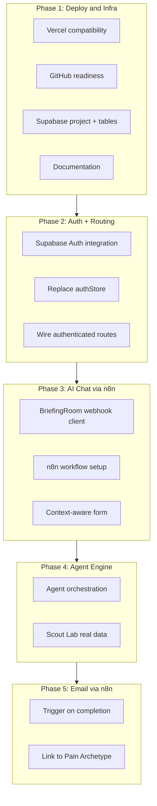

# PainScope AI: Phased Project Plan

## Corrections and Validation of Your Approach

**Deploy order:** Your sequence (GitHub → Vercel → Supabase) works. One nuance: you need Supabase credentials (URL, anon key) for the app to work. Practical order: create a Supabase project early (free, quick), then deploy to Vercel with env vars. You can deploy Vercel first and add Supabase env vars in a follow-up deploy.

**No localStorage:** Correct. Auth session will come from Supabase Auth (cookies/memory). User profiles, briefings, pains, and settings will live in Supabase tables. We will remove Zustand `persist` for auth and move all persistent data to Supabase.

**n8n for AI chat:** Supported. Flow: user submits → POST to n8n webhook → AI node (OpenAI/Claude) → Respond to Webhook with full reply. You accepted full response (no streaming), so this fits n8n.

**n8n for email:** Supported. Your existing email workflows can be triggered when agents complete (webhook from our backend or a small API).

---

## Phase Overview

---

## Phase 1: Deployment and Infrastructure

**Goal:** Deploy to Vercel, create Supabase project, define tables, and document everything.

**What you do:** Push to GitHub, deploy on Vercel, create Supabase project.

**What we do in code:**

1. **Vercel compatibility**
  - Add root `[vercel.json](app/vercel.json)` (or at repo root) with `"root": "app"` if repo root is above `app/`
  - Change Vite `base` from `'./'` to `'/'` in `[vite.config.ts](app/vite.config.ts)` for SPA routing on Vercel
  - Optional: remove `kimi-plugin-inspect-react` from `[vite.config.ts](app/vite.config.ts)` and devDependencies in `[package.json](app/package.json)`
2. **Supabase schema**
  - Tables: `profiles` (extends auth.users), `briefings`, `briefing_messages`, `pain_archetypes`, `pain_sources`, `agent_jobs`, `agent_logs`, `user_settings`, `notifications`
  - RLS policies for user-scoped access
  - SQL migrations in `supabase/migrations/`
3. **Documentation**
  - `docs/DEPLOYMENT.md`: GitHub → Vercel (root, env vars, build)
  - `docs/SUPABASE.md`: project setup, env vars, schema overview
  - `.env.example`: `VITE_SUPABASE_URL`, `VITE_SUPABASE_ANON_KEY`, `VITE_N8N_WEBHOOK_URL` (placeholders)

**Deliverables:** App builds and deploys on Vercel; Supabase project with migrations; deployment and Supabase docs.

---

## Phase 2: Supabase Auth and Authenticated Routing

**Goal:** Replace auth with Supabase Auth and wire all authenticated pages.

**What we do:**

1. **Supabase Auth**
  - Install `@supabase/supabase-js`
  - Replace `[authStore.ts](app/src/store/authStore.ts)` with Supabase Auth calls (signUp, signInWithOtp, signInWithPassword, signInWithOAuth, resetPassword, etc.)
  - Add passwordless OTP sign-in flow in `[AuthModal.tsx](app/src/sections/AuthModal.tsx)`
  - Remove localStorage auth; keep Zustand for in-memory state only
2. **Profiles and user data**
  - Sync auth user to `profiles` (trigger or on first login)
  - Read/write profiles, settings via Supabase client
3. **Authenticated routing**
  - Extend `[App.tsx](app/src/App.tsx)` to support `dashboard | briefing | scout | library | settings`
  - If authenticated and `!user?.industry`: show BriefingRoom; else Dashboard
  - Render Dashboard, BriefingRoom, ScoutLab, PainLibrary, Settings based on route
  - `handleAuthSuccess` navigates to briefing or dashboard
4. **Protected routes**
  - Redirect unauthenticated users from dashboard/briefing/scout/library/settings to landing

**Deliverables:** Working auth (Google + email/password + OTP), all authenticated pages reachable, no auth data in localStorage.

---

## Phase 3: AI Briefing Chat via n8n

**Goal:** Briefing chat driven by n8n webhook and AI.

**What you do:** Create n8n workflow: Webhook (POST) → AI node (OpenAI/Claude) → Respond to Webhook. Expose webhook URL.

**What we do:**

1. **BriefingRoom webhook integration**
  - In `[BriefingRoom.tsx](app/src/sections/BriefingRoom.tsx)`: on send, POST `{ messages, briefingData }` to `VITE_N8N_WEBHOOK_URL`
  - Parse JSON response and append assistant message
  - Add loading state while waiting for response
2. **Context and structured output**
  - n8n workflow receives full chat history and briefing so far
  - AI prompt: Strategist persona; extract industry, product focus, competitors, target audience
  - Response shape: `{ reply: string, extractedData?: Partial<BriefingData> }` for pre-filling form
3. **Context-aware form**
  - Pre-fill confirmation form from `extractedData`
  - Add optional industry-specific fields (e.g., compliance, geography) based on extracted industry
4. **Persist to Supabase**
  - Save messages and briefing to `briefings` and `briefing_messages` tables

**Deliverables:** Briefing chat powered by n8n AI; pre-filled confirmation form; briefing data stored in Supabase.

---

## Phase 4: Agent Engine

**Goal:** Real agent orchestration and data flow into Scout Lab and Pain Library.

**What we do:**

1. **Job creation**
  - On “Launch Scouts,” create row in `agent_jobs` and call n8n webhook with briefing context
2. **Agent orchestration (n8n or LangGraph)**
  - If n8n: workflow crawls sources (Reddit, Twitter, etc.), runs NLP, computes PainScore, writes to `pain_archetypes` and `pain_sources`
  - If LangGraph: Python/Node service does same; we add API routes or use n8n as orchestrator
3. **Scout Lab**
  - Poll or subscribe for `agent_jobs` and `agent_logs`
  - Replace mock logs and pains in `[ScoutLab.tsx](app/src/sections/ScoutLab.tsx)` with Supabase data
4. **Pain Library**
  - Replace mock data in `[PainLibrary.tsx](app/src/sections/PainLibrary.tsx)` with Supabase `pain_archetypes` and `pain_sources`

**Deliverables:** Live agent runs, real pains in Scout Lab and Pain Library.

---

## Phase 5: Email Delivery via n8n

**Goal:** Trigger n8n email workflow when agents complete; include links to Pain Archetypes.

**What you do:** Add n8n workflow: Webhook receives `{ jobId, userId, pains[] }` → send email with summary and links.

**What we do:**

1. **Completion webhook**
  - When agent job completes, call n8n email webhook with job summary and archetype IDs
2. **Email content**
  - n8n builds HTML/PDF with pains and links like `https://yourapp.vercel.app/library?painId=xxx`
3. **Deep links**
  - Pain Library reads `?painId=` from URL and opens the matching archetype detail

**Deliverables:** Emails sent on completion; links open the correct Pain Archetype in the app.

---

## Phase 6: Polish and PRD Alignment

**Goal:** Close remaining PRD gaps and improve UX.

**Scope:** CRM “Push to CRM” wiring (if applicable), export (CSV/PDF), search behavior, notification preferences persisted to Supabase, accessibility tweaks.

---

## Summary Table

| Phase | Focus             | Main Output                                             |
| ----- | ----------------- | ------------------------------------------------------- |
| 1     | Deploy + Supabase | Vercel deploy, Supabase project, migrations, docs       |
| 2     | Auth + Routing    | Supabase Auth, authenticated app shell, no localStorage |
| 3     | AI Chat           | n8n webhook + AI, pre-filled briefing form              |
| 4     | Agents            | Real discovery pipeline, Scout Lab and Pain Library     |
| 5     | Email             | n8n email workflow, completion webhook, deep links      |
| 6     | Polish            | CRM, export, search, settings persistence               |

---

## Execution Order

We will execute one phase at a time. Phase 1 is first: Vercel compatibility, Supabase migrations, and documentation.